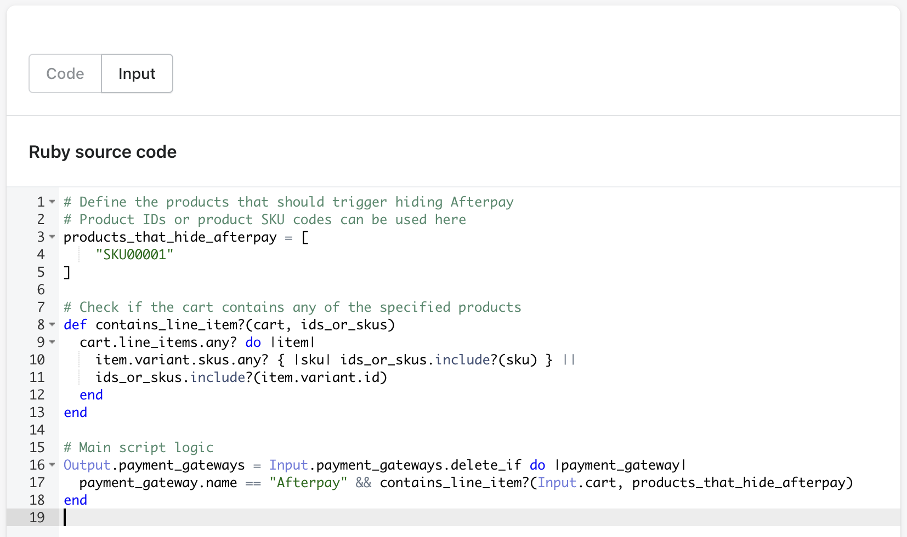

# Luke + We Are Digital

## Introduction

This document outlines the steps taken to complete the [challenge](https://werd.atlassian.net/wiki/external/MzkxMDI3Y2NkYWE3NGQ1M2EyNGFmYjQxMDU4YTk2YjE). The task involved making specific changes to a Shopify store, a platform I had not worked with before outside of tinkering and using some of the data api endpoints. I found the challenge to be a great way to get introduced to some complex, shopify specific concepts like the graphQL mutation API for updating checkout styles and the script editor for modifying checkout behaviour.

### Completed Test URL

- [Shopify Demo Site](https://lukes-we-are-digital-test.myshopify.com/)
- [Demo Loom](https://www.loom.com/share/b55e385288af406caf50391affdc24bf?sid=12a035e9-9e95-4fcc-a943-5168ac4d9326)

## Process Overview

### Duration

The challenge took approximately two hours for me to complete. I was unfamiliar with the core Shopify concepts, So most of that was spent reading through the documentation, though the required changes were very straightforward once I got on the right track.

## Specific Tasks and Solutions

### 1. Styling Checkout Headings to Uppercase

#### Objective

The brief says:

> Update the styling of the checkout headings so that all headings are in uppercase.

Though the image only highlighted the level 2 & 3 headings `CONTACT`, `DELIVERY`, `SHIPPING METHOD` & `PAYMENT`.

I chose to update ALL the headings including level 1 headings.
which were uppercase in the image but not highlighted.

If the intention was to only update level 2 & 3 headings, I could easily revert the level 1 headings by changing it's `letterCase` value to `NONE`.

#### Approach

Initially, I searched for CSS styles within the Shopify theme templates, assuming the changes would be made in css. However, it quickly became apparent that the checkout components were not defined in the template files.

#### Solution

I used Shopify's GraphQL mutation API, specifically designed for modifying checkout styles. Using the documentation, I adapted one of the examples to apply uppercase styling to all available headings.

[Shopify Documentation](https://shopify.dev/docs/apps/checkout/styling/typography#step-6-style-level-one-headings)

##### Implementation

To work with the mutation API, first I had to find the checkout profile id. This was straightforward, taken right from the docs.

- [fetchCheckoutProfileId](src/fetchCheckoutProfileId.graphql)

Then I executed the following GraphQL mutation to update the heading styles:

- [uppercaseHeadings](src/uppercaseHeadings.graphql)
- [uppercaseHeadingsVariables](src/uppercaseHeadingsVariables.json)

```graphql
mutation uppcaseHeadings($checkoutBrandingInput: CheckoutBrandingInput!, $checkoutProfileId: ID!) {
  checkoutBrandingUpsert(
    checkoutBrandingInput: $checkoutBrandingInput
    checkoutProfileId: $checkoutProfileId
  ) {
    checkoutBranding {
      customizations {
        headingLevel1 {
          typography {
            letterCase
          }
        }
        ...
      }
    }
  }
}
```

### 2. Show/Hide Payment Gateway

#### Objective
Implement functionality to show or hide a payment gateway if matched products are added to cart. The products should be editable by store admins.

#### Approach
For this task, I utilized Shopify's Script Editor app, which provided me with an example ruby script for this exact use-case that I was able to extend.

I used the script editor to be pragmatic, in the interest of time-to-market, but it looks like scripts are being deprecated in just under 12 months, So if this was going into production for a client, this might only be an MVP and I would definitely look into building v2 as a custom app using shopify's functions API. Which would allow me to build something reuseable across multiple projects. Where as this implementation is per-project.

#### Solution
I edited the example script to target the mock `Afterpay` payment gateway setting the `payment_gateway.name` in the code block. And I added a filter to check for products in the cart that match a list of SKU codes.

This solution requires that products you choose to hide the payment gateway for, actually have SKU codes which seems to not be required by default on Shopify and wasn't part of the example data set. So for the product I wanted to test with - The Collection Snowboard: Liquid - I added a SKU code `SKU0001` for testing.

To be a bit more flexible, I made the filter work for SKU codes and also product variant IDs.

I tested the solution by adding/removing the product to the cart to confirm its functionality as per the loom video.

[Shopify Script Editor Guide](https://help.shopify.com/en/manual/checkout-settings/script-editor)




## Conclusion

This challenge was a good introduction to some core concepts and idioms of Shopify that I had not seen before, and I enjoyed it.

It required problem-solving and adaptability, navigating a platform that was new to me. I feel the successful completion of the challenge demonstrates my ability to quickly learn and apply new technologies in a real-world scenario.